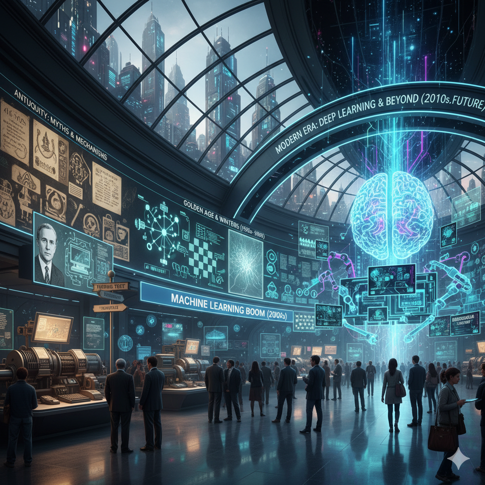
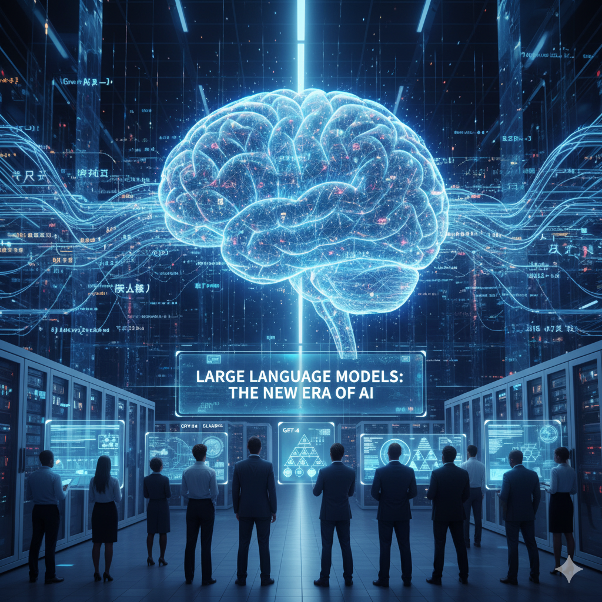
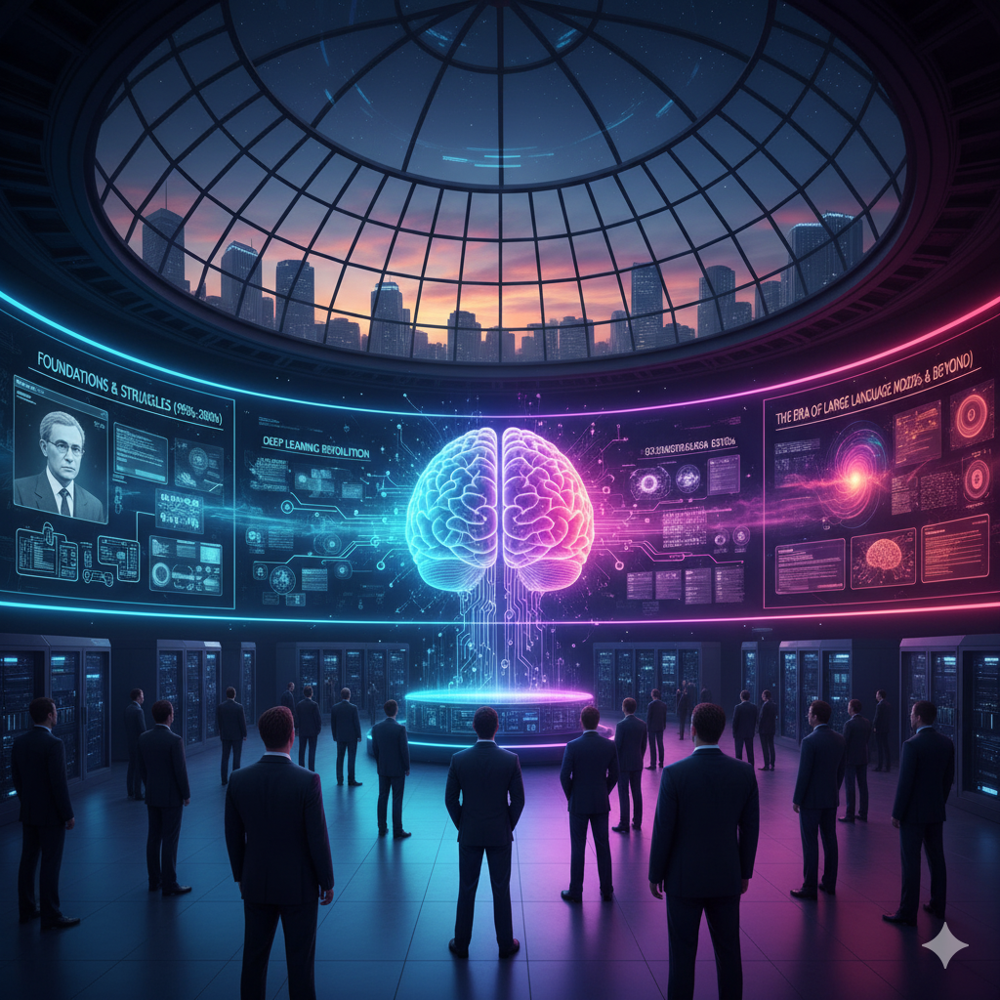

# The Evolution of Artificial Intelligence: From Logic Machines to Agentic AI:

## Introduction:
- Defines AI and outlines its journey from rule-based logic to autonomous agents.

## Early Foundations (1940s–50s):
 - Alan Turing’s work and the Turing Test establish AI’s conceptual base.

## Dartmouth Conference (1956):
 - Birth of AI as a field, led by McCarthy, Minsky, and others.

## Symbolic AI (1956–70s):
 - Logic-based systems aimed to mimic human reasoning.

## First AI Winter (1970s):
 - Overhype and technical limits cause funding cuts.

## Expert Systems (1980s)
 - Knowledge-based AI achieves success but struggles to scale.

## Machine Learning (1990s–2000s)
 - Shift to data-driven models; notable success with Deep Blue.

## Deep Learning (2010s)
 - Neural networks and GPUs drive breakthroughs in vision and speech.

## Transformers & Generative AI (2017–2020s)
 - GPT and similar models enable text, image, and code generation.

## Agentic AI (2020s–Present)
 - Autonomous, reasoning agents emerge (e.g., AutoGPT, OpenAI o1).

## Key Figures
 - Turing, McCarthy, Minsky, Hinton, LeCun, and Bengio shape AI’s development.

## Future Outlook
 - Focus shifts to ethical, safe, and collaborative human–AI systems.

## Large Language Models work by:

1. Predicting the next token using the Transformer architecture.

2. Learning from massive amounts of text data.

3. Scaling up with billions of parameters and advanced hardware.

4. Being fine-tuned with human feedback for reliability and alignment.

| **Era**     | **Dominant Approach** | **Paradigm Shift**                        |
| ------------ | --------------------- | ----------------------------------------- |
| 1950s–70s   | Symbolic reasoning    | Logic → Knowledge Representation          |
| 1980s       | Expert systems        | Rules → Domain Expertise                  |
| 1990s–2000s | Machine learning      | Hand-coded → Data-driven                  |
| 2010s       | Deep learning         | Manual features → Representation learning |
| 2020s       | LLMs & Agentic AI     | Prediction → Autonomous reasoning         |
